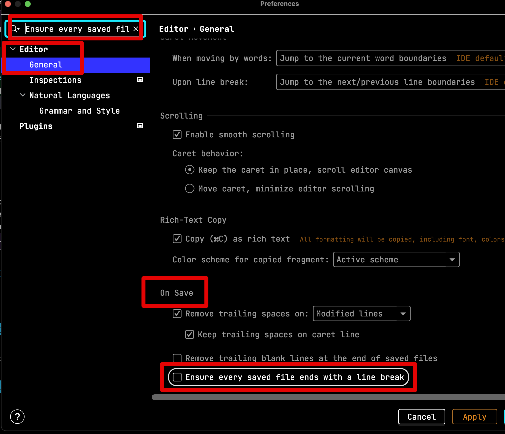

# IntelliJ (Kotlin) 매 파일마다 newline 자동으로 추가하기 (feat. EditorConfig)

Github 의 코드리뷰를 보면 다음과 같이 `No newline at end of file` 메세지를 보여준다


이는 `파일 끝에 개행문자(newline)이 없습니다` 라는 의미인데, [POSIX 기반의 규칙](https://pubs.opengroup.org/onlinepubs/9699919799/basedefs/V1_chap03.html#tag_03_206)에 기반한다.  
EOF 가 없으면 컴파일 에러가 나는 상황을 대비한 규칙이며, 요즘 그럴일은 없지만 그래도 의도한대로 파일이 작동되는 것을 보장하기 위해 웬만해선 자동으로 규칙을 정해놓고 관리하는 것을 추천한다.   
  
해결책은 크게 2가지가 있다.

## 1. IDE 설정으로 해결하기

가장 쉬운 방법은 IDE의 설정으로 항상 파일 끝에 `newline`을 추가하도록 하는 것이다.  

* IDE 설정 (Settings/Preferences) 을 열어 `Ensure every saved file ends` 을 검색한다.  
* 아래와 같이 `Ensure every saved file ends` 항목을 **체크**한다.



이렇게 하면 **파일을 저장할때마다 항상 newline을 추가**한다.  
  
다만, 이 방법을 추천하진 않는다.  
웬만하면 아래 2번째 방법을 사용하자.


## 2. EditorConfig로 프로젝트 자체 설정으로 해결하기

**IDE 설정을 수정하기 보다는 editorconfig로 설정**을 하는 것이 프로젝트 관리하는데 있어서 편하다.  

* 개발환경이 집/회사/개인노트북 등 여러 곳에 분산되어서 개발해야하는 경우
* 나 외에 다른 사람들도 같이 개발해야하는 경우
  
등등 IDE 설정을 매번 하기보다는 `.editorconfig` 로 하는 것을 강력추천한다.  
[EditorConfig](https://editorconfig.org/) 는 코드 스타일을 관리하는 표준 도구이다.  
대부분의 IDE에서 이를 지원하기 때문에 **파일 저장시 각종 규칙에 맞게 일관된 코드 스타일을 관리**할 수 있다.  
  
[Ktlint](https://ktlint.github.io/) 를 쓰더라도 [EditorConfig](https://editorconfig.org/) 를 사용하는 이유는 다음과 같다.


```bash
root = true

[*]
charset = utf-8
end_of_line = lf
indent_size = 4
indent_style = space
trim_trailing_whitespace = true
insert_final_newline = true
max_line_length = 120
tab_width = 4

[*.{kt,kts}]
disabled_rules=import-ordering
```

* 출처: [benelog님의 ktlint](https://blog.benelog.net/ktlint.html#editorconfig_%EC%84%A4%EC%A0%95)


> 젯브레인 계열 IDE에서 EditorConfig를 사용하는 자세한 방법은 [공식 문서](https://www.jetbrains.com/help/idea/editorconfig.html)를 참고하면 좋다