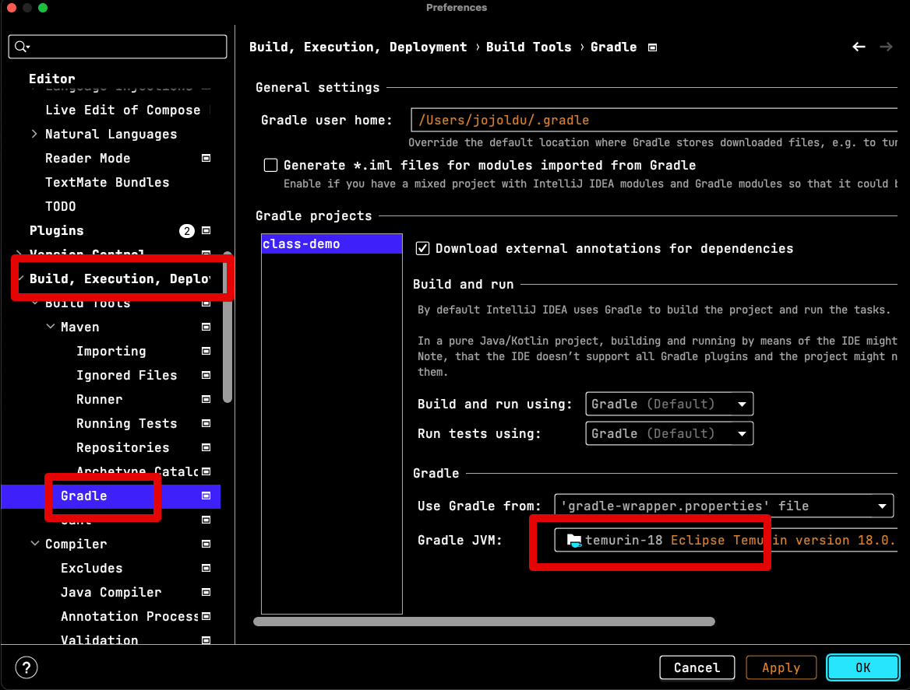
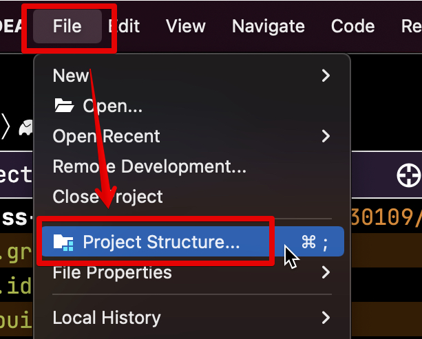
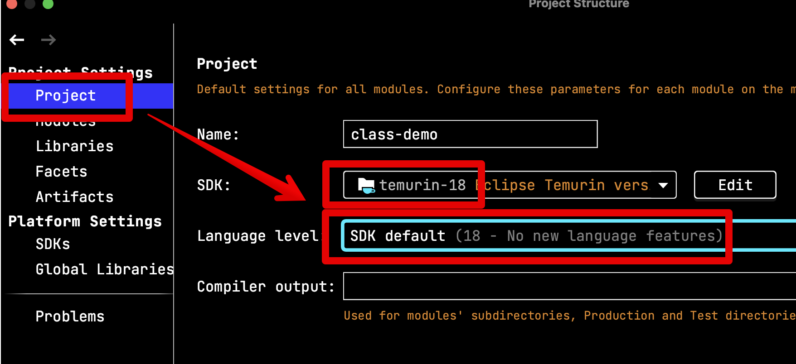
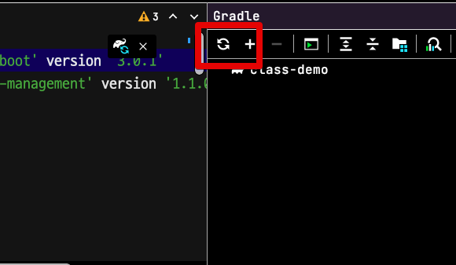
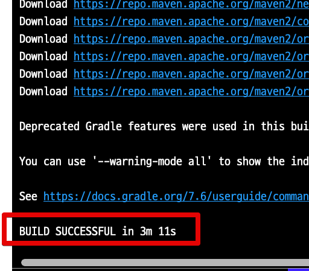

# Spring Boot 3.x 실행이 안될 경우 (feat. IntelliJ)

스프링 부트 3.0 이 출시되었다.  
(현재 최신은 3.0.1 이지만)

3.0 부터는 **Java 17부터 지원**된다.  
그러다보니 기존에 Java8, 11등을 사용하시던 분들은 3.x 스프링 부트 프로젝트를 실행할때 에러들을 만나게 되는데, 이번에 나도 똑같이 경험해서 정리하게 되었다.

## 문제

스프링 부트 3.0.1 프로젝트를 실행할 일이 생겼다.  
그래서 기존에 설치된 IntelliJ에서 Gradle Import를 시켰더니 다음과 같이 방다한 에러 메세지와 함께 실행이 되지 않았다.

> 기존 노트북에서 모두 Java 11로 프로젝트를 구동시켰었다.

```gradle
No matching variant of org.springframework.boot:spring-boot-gradle-plugin:3.0.1 was found. The consumer was configured to find a runtime of a library compatible with Java 16, packaged as a jar, and its dependencies declared externally, as well as attribute 'org.gradle.plugin.api-version' with value '7.6' but:
          - Variant 'apiElements' capability org.springframework.boot:spring-boot-gradle-plugin:3.0.1 declares a library, packaged as a jar, and its dependencies declared externally:
              - Incompatible because this component declares an API of a component compatible with Java 17 and the consumer needed a runtime of a component compatible with Java 16
              - Other compatible attribute:
                  - Doesn't say anything about org.gradle.plugin.api-version (required '7.6')
          - Variant 'javadocElements' capability org.springframework.boot:spring-boot-gradle-plugin:3.0.1 declares a runtime of a component, and its dependencies declared externally:
              - Incompatible because this component declares documentation and the consumer needed a library
              - Other compatible attributes:
                  - Doesn't say anything about its target Java version (required compatibility with Java 16)
                  - Doesn't say anything about its elements (required them packaged as a jar)
                  - Doesn't say anything about org.gradle.plugin.api-version (required '7.6')
          - Variant 'mavenOptionalApiElements' capability org.springframework.boot:spring-boot-gradle-plugin-maven-optional:3.0.1 declares a library, packaged as a jar, and its dependencies declared externally:
              - Incompatible because this component declares an API of a component compatible with Java 17 and the consumer needed a runtime of a component compatible with Java 16
              - Other compatible attribute:
                  - Doesn't say anything about org.gradle.plugin.api-version (required '7.6')
          - Variant 'mavenOptionalRuntimeElements' capability org.springframework.boot:spring-boot-gradle-plugin-maven-optional:3.0.1 declares a runtime of a library, packaged as a jar, and its dependencies declared externally:
              - Incompatible because this component declares a component compatible with Java 17 and the consumer needed a component compatible with Java 16
              - Other compatible attribute:
                  - Doesn't say anything about org.gradle.plugin.api-version (required '7.6')
          - Variant 'runtimeElements' capability org.springframework.boot:spring-boot-gradle-plugin:3.0.1 declares a runtime of a library, packaged as a jar, and its dependencies declared externally:
              - Incompatible because this component declares a component compatible with Java 17 and the consumer needed a component compatible with Java 16
              - Other compatible attribute:
                  - Doesn't say anything about org.gradle.plugin.api-version (required '7.6')
          - Variant 'sourcesElements' capability org.springframework.boot:spring-boot-gradle-plugin:3.0.1 declares a runtime of a component, and its dependencies declared externally:
              - Incompatible because this component declares documentation and the consumer needed a library
              - Other compatible attributes:
                  - Doesn't say anything about its target Java version (required compatibility with Java 16)
                  - Doesn't say anything about its elements (required them packaged as a jar)
                  - Doesn't say anything about org.gradle.plugin.api-version (required '7.6')

```

그래서 이런 에러들이 나온다면 다음의 방법들을 시도해보자.

## 해결

이 문제의 해결책으로 **스프링 부트 2.7.x 로 다운그레이드** 하면된다는 글들도 몇개 발견하였다.  
  그건 원하던 해결책이 아니라서 이 글에서는 완전히 배제한다.  

### 1. Java

스프링 부트 3.0 부터는 Java 17이 필수다.  
그래서 현재 설치된 Java 버전이 무엇인지 확인해보고 **17버전 이상인지** 확인 후, 그 이하라면 17 이상을 설치한다.

```bash
java -version
```


Java 17 이상인데도 여전히 프로젝트의 오류가 그대로 발생한다면 다른 설정들을 확인해본다.

### 2. build.gradle

해당 프로젝트의 `sourceCompatibility` 가 17이상으로 되어있는지 확인한다.


```groovy
sourceCompatibility = '17'
```


이 설정까지 해도 안된다면, IntelliJ 설정이 안되어있을 확률이 높다.

### 3. IntelliJ

결국 이 프로젝트를 실행하는 **IntelliJ가 프로젝트를 Java 17로 실행**해야만 한다.  
  
그래서 아래 설정들을 따라 Java 17 이상으로 IntelliJ를 설정한다.

#### 3-1. Gradle Build

IntelliJ의 `Preferences/Settings` -> `Build, Execution, Deployment` -> `Build Tools` -> `Gradle` 로 이동한다.  
  
그럼 아래와 같이 Gradle 설정이 나오는데, 이때 **Gradle의 JVM이 Java 17이상인지** 확인한다.  



만약 17이상이 아니라면 17이상으로 설정한다.

#### 3-2. Project SDK

다음으로 `File` -> `Project Structure..` 로 이동하여 프로젝트 SDK의 버전을 확인후 Java 17이상으로 설정한다.  



  
**Project**



**Modules**


### Gradle Refresh

IntelliJ까지 설정이 모두 끝났다면 다시 Gradle Refresh를 실행해보자.



그럼 이제 다음과 같이 정상적으로 빌드가 되는 것을 확인할 수 있다.

