# Utterances 에서 Giscus 로 마이그레이션하기

블로그의 댓글을 [Utterances](https://utteranc.es/) 에서 [Giscus](https://giscus.app/ko) 로 마이그레이션 했다.  

기존 댓글을 잘 사용하고 있었지만, 장점이 훨씬 많은 Giscus로 이관하게 되었다.

## 1. Giscus 장점

[Giscus](https://giscus.app/ko) 는 [Utterances](https://utteranc.es/)에 비해 많은 장점들이 있다.

### 대댓글

### 댓글 수, 댓글 정렬, 게시물에 대한 반응

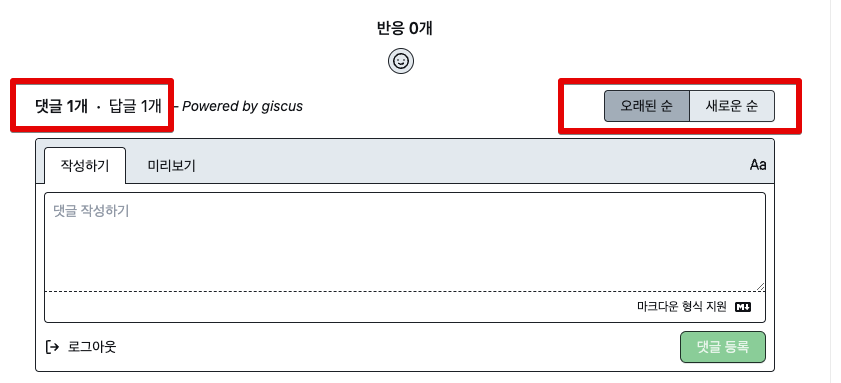

### 다양한 테마

생각보다 많은 테마와 사용자가 직접 생성한 테마를 적용할 수 있다.

블로그에 적용된 테마는 `Github Light High Contrast` 테마이다.  
(High Contrast 테마는 JetBrains IDE에서도 사용하는 애정하는 테마이다.)  

### 그 외 장점

- 지연 로딩 댓글 
- 다국어 (한국어 포함) 
- 봇 자체 호스팅 
- 기타 당등 고급 옵션과 같은 많은 새로운 기능을 추가

가장 중요한건 실제로 계속해서 **관리가 되고 있는 오픈소스라**는 것이다.  
(대조적으로 Utterances는 몇달 업데이트가 없기도 했다. - 요즘은 업데이트를 확인하지 않았다.)

기존 Utterances는 다음과 같이 **동일 이슈가 중복 생성**되는 버그 등이 존재한다는 점을 생각해보면 옮겨야할 이유가 많았다.

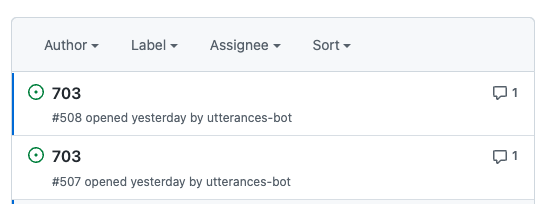

그래서 나처럼 기존 [Utterances](https://utteranc.es/) 에 부족함을 느꼈다면 [Giscus](https://giscus.app/ko)로 마이그레이션을 진행하자.

## 2. Giscus 설치

### 2-1. 저장소 준비

먼저 기존에 댓글을 issue로 관리하던 Github 저장소의 Discussion을 활성화시켜야 한다.  
(Giscus가 Github의 Discussions 기반)  

**Settings** -> **General**

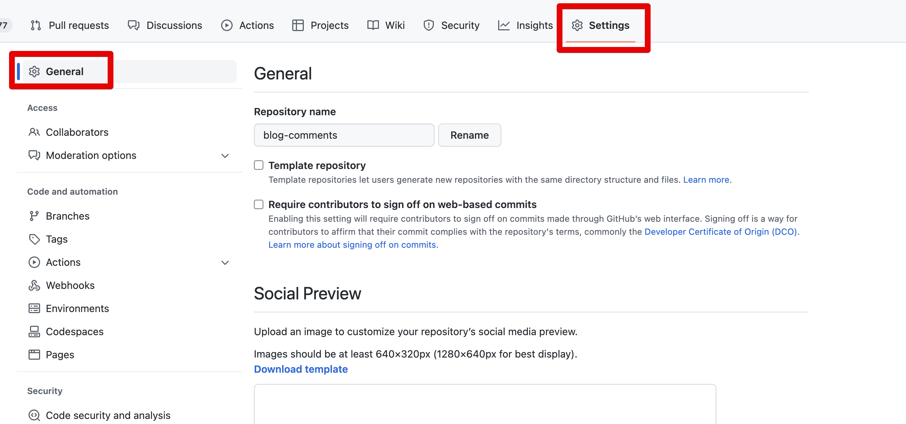

**Feature** -> **Discussions** 체크

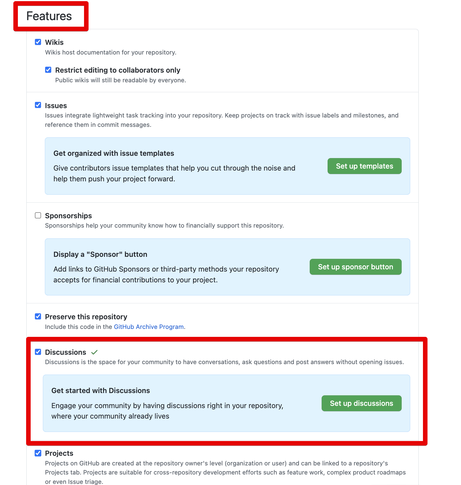

### 2-2. Discussions 에 신규 카테고리 추가

활성화된 Discussions 로 가서 댓글들을 담을 신규 카테고리를 생성한다.

에디터 버튼 (펜 모양) 을 클릭후 **New category**를 클릭 한다.

카테고리명을 `Comments` 로 하고, **Announcement** (소유자만 새 토론을 생성할 수 있지만, 댓글과 대댓글은 누구나 가능한 포맷)를 선택하여 생성한다.

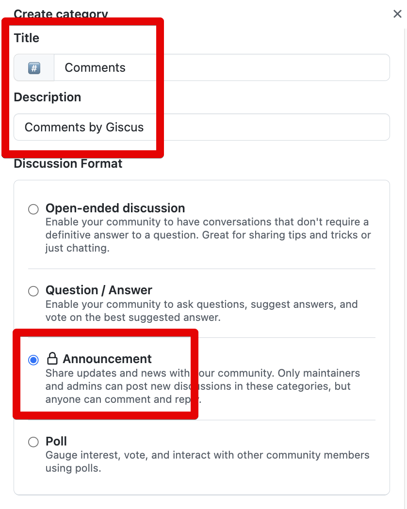

그 외 카테고리들은 혹시 모를 상황을 대비해 공지사항 용도의 일부만 남겨두고 다 제거한다.

앞으로 만들어질 댓글들은 모두 이 `Comments` 카테고리에서 토론으로 관리 된다.

### 2-2. 앱 설치

이제 위에서 설정한 저장소에 Giscus App을 설치한다.  
아래 링크로 가서 등록한다.

- [App 설치 페이지](https://giscus.app/ko)

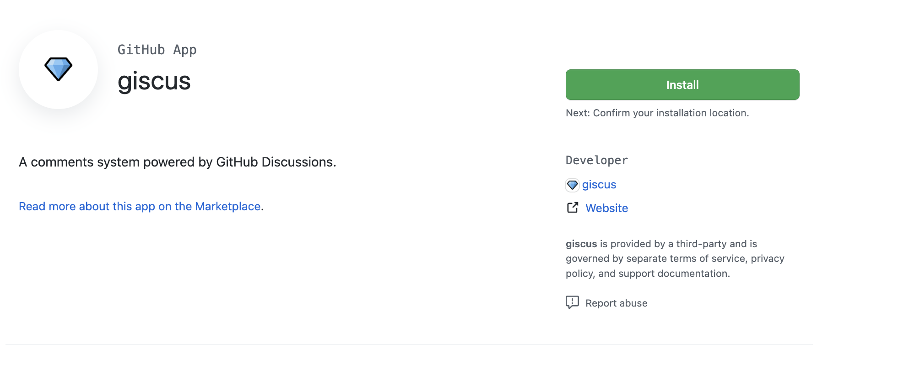

Giscus가 굳이 전체 저장소의 권한을 가질 필요는 없으니, 댓글 저장소에 대한 권한만 가지도록 설정한다.

 
이제 App을 설치했으니 [Giscus App 페이지](https://giscus.app/) 로 이동해서 내 마음에 맞는 댓글 시스템을 구성해본다.

**언어 및 저장소 설정**

게시글과 Discussion을 매핑할 방법을 선택한다.  
`제목이 페이지 경로를 포함`을 선택하는 것이 이후 **Issue에서 Discussion으로 마이그레이션 하기 쉬우므로** 가능한 위 방법을 선택한다.  
(물론 마이그레이션할 게 없다면 원하는 방법을 선택한다.)  

새로 만든 `Comments` 카테고리를 선택한다.

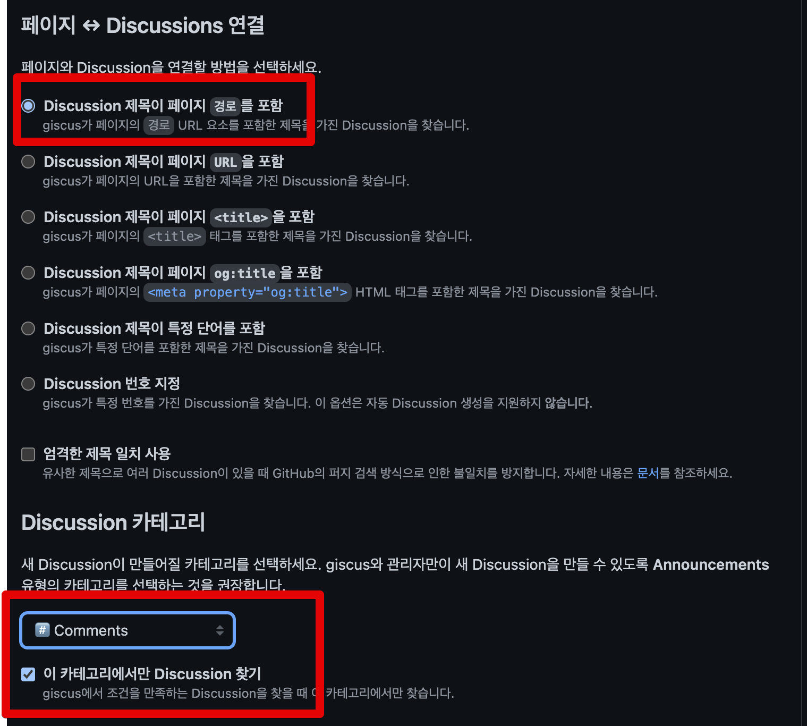

그 외 기타 등등 옵션들을 선택한다.  
(지연 로딩 등등의 활성화)  
  
마지막으로 **테마를 선택**하면, 모든 설정은 끝난다. 
  
설정이 다 마무리 되면 다음과 같이 임베딩 시킬 수 있는 JavaScript 코드를 생성해준다.

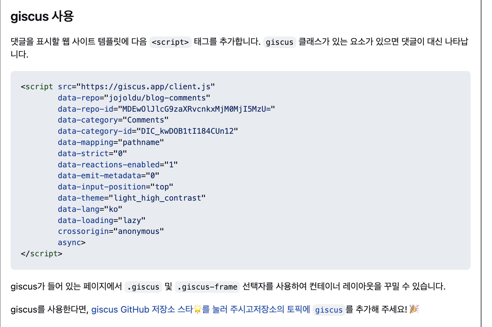

해당 코드를 복사해서 본인의 블로그에 붙여넣는다.

### 2-4. 티스토리 교체

> 티스토리가 아니면 본인의 블로그에 맞는 적절한 위치의 코드를 교체하면 된다.

본인 블로그의 기존 `Utterance` 스크립트를 주석처리 하고 위에서 만든 Giscus 스크립트를 붙여넣는다.

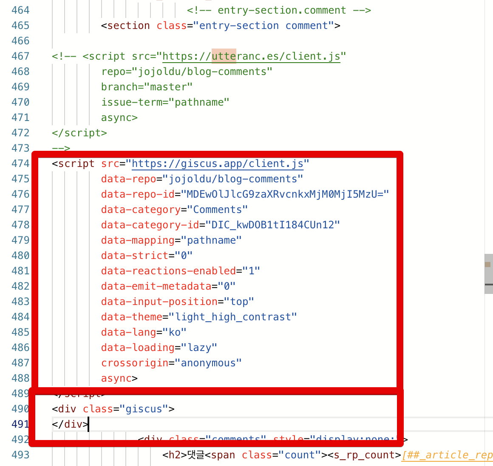

단, Giscus는 `class="giscus"` 영역에 레이아웃을 그리기 때문에 위 그림처럼 `

` 코드를 댓글의 위치에 꼭 넣어줘야한다.

이렇게 하면 Giscus를 블로그에 설치하는 것은 끝이다.  

## 3. 마이그레이션

기존 Utterance에서 생성된 댓글들 (Issue) 을 Discussions으로 옮겨야한다.  
하지만... 아쉽게도 현재 Github 시스템에서는 **대량으로 issue를 discussions으로 옮기는 기능을 지원하지 않는다**.  

- [공식 문서](https://docs.github.com/en/discussions/managing-discussions-for-your-community/moderating-discussions#converting-an-issue-to-a-discussion)

> 전체 선택해서 한번에 이관하는 버튼이 있을줄 알았는데.... 없었다...  

그래서 2가지 방법이 있다.

- Github 오픈 API를 활용한 스크립트를 만들어서 옮긴다
- 손으로 직접 하나씩 옮긴다.

게시글이 수백개인 분들은 많지 않으니 일단 수동으로 옮기는 방법을 소개한다.

> 스크립트 작성해서 옮길까 했지만, 손으로 해도 30분이면 될것같아서 크롬 단축키 쓰면서 수동 이관 했다.

기존 Issue 를 하나 클릭해보면 우측 하단에 다음과 같이 **Convert to discussion** 버튼이 있다.

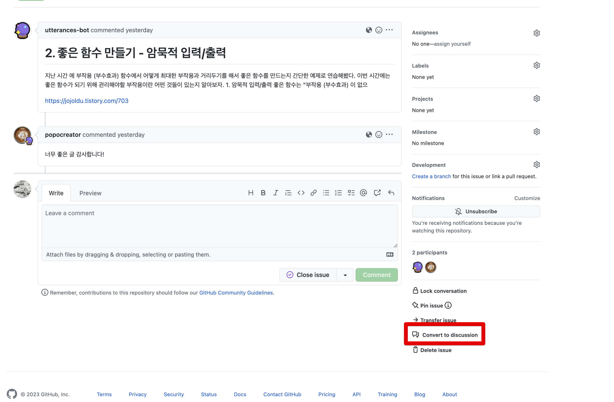

해당 버튼을 클릭하면 다음과 같이 카테고리를 선택해서 Convert를 진행한다.

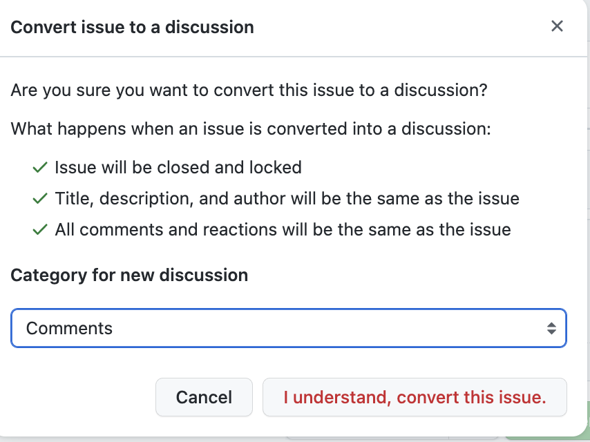

그럼 다음과 같이 Discussions으로 마이그레이션된 것을 확인할 수 있다.

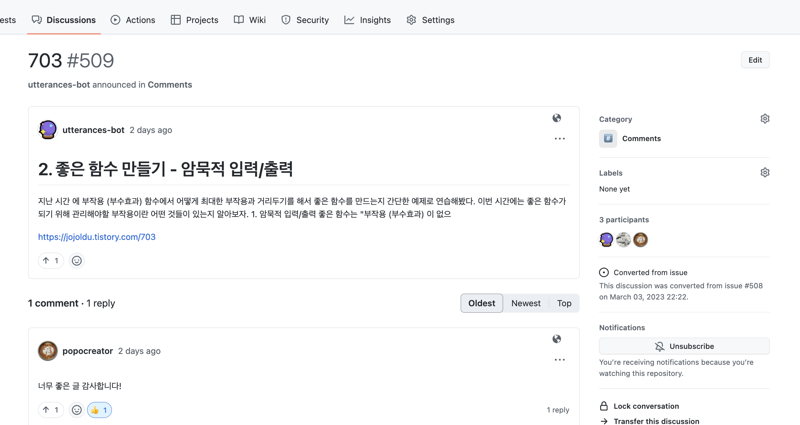

실제 블로그에 방문해보면 정상적으로 댓글이 노출되는 것을 확인할 수 있다.

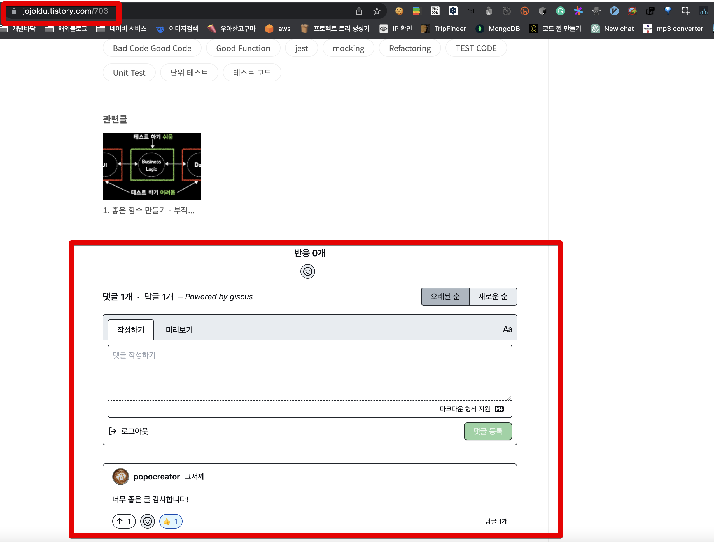

